

  
  

	  <a href="#about">About</a> •
    <a href="#instalación">Instalación</a>
  

## About

Este documento es n ejercicio de administración de sistemas.

Este proyecto busca introducirte al maravilloso mundo de la virtualización.

Crearás tu primera máquina en VirtualBox (o UTM si no puedes utilizar VirtualBox) bajo instrucciones específicas. Por lo tanto, al final del proyecto, serás capaz de configurar tu propio sistema operativo utilizando reglas estrictas.

[Click aquí](./es.subject.pdf) para ver el `PDF` del proyecto.

  ## Instalación

  1 - Abrimos VirtualBox y pinchamos en `Nueva`
  
  

  2 - Introducimos el nombre de nuestra máquina virtual, la ruta de instalaciOn y la imagen ISO del Sistema Operativo a instalar. En mi caso estoy instalando `Debian 12.5`.
  
  

  

  3 - Asignamos la cantidad de RAM para la mAquina.
  
  

  4 - Creamos un disco virtual ahora.
  
  

  
  5 - Establecemos la memoria que queramos, en este caso yo he usado `30,80 GB` ya que quiero hacer el bonus. En caso de que no queramos hacerlo podemos usar la cantidad recomendada de `12 GB`.
  
  
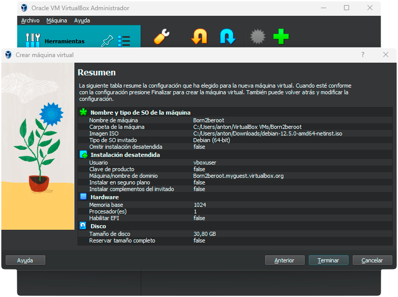

  6 - Comprobamos en el resumen que hemos elegido todo correctamente y presionamos `Terminar`.
  
  

  7 - Volvemos a la pantalla de inicio de Oracle y presionamos en `ConfiguraciOn`.
  
  
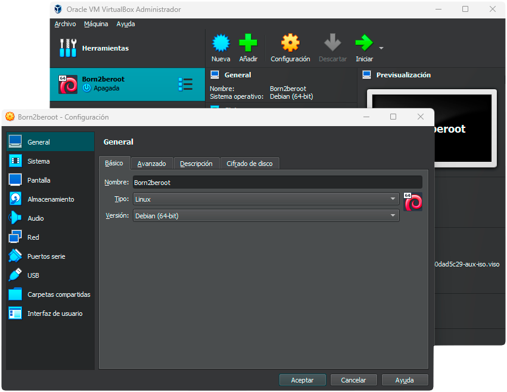

  
  8 - Ahora pincharemos en `Almacenamiento`.
  
  

  9 - Elegimos el controlador: IDE y presionando el enoticono 💿 se nos despliegan varias opciones. Yo he seleccionado `debian-12.5.0` porque es el sistema que estamos instalando.
  
  
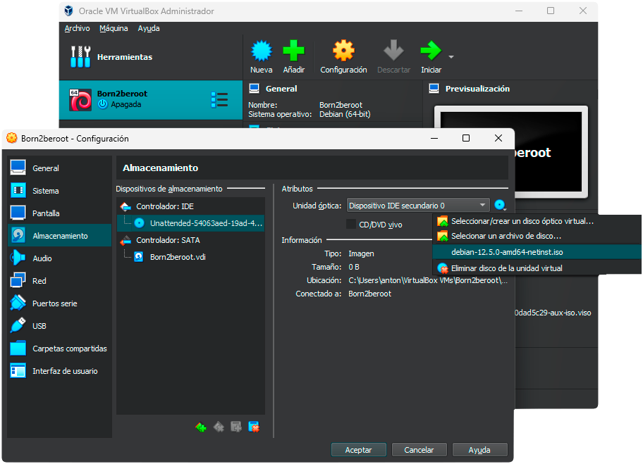

  10 - Una vez realizado esto podemos hacer click en `Iniciar`.
  
  

  11 - Se nos abrirá el menú de instalación de `debian` y elegiremos `Install`.
  
  

  12 - Escogemos un idioma.
  
  
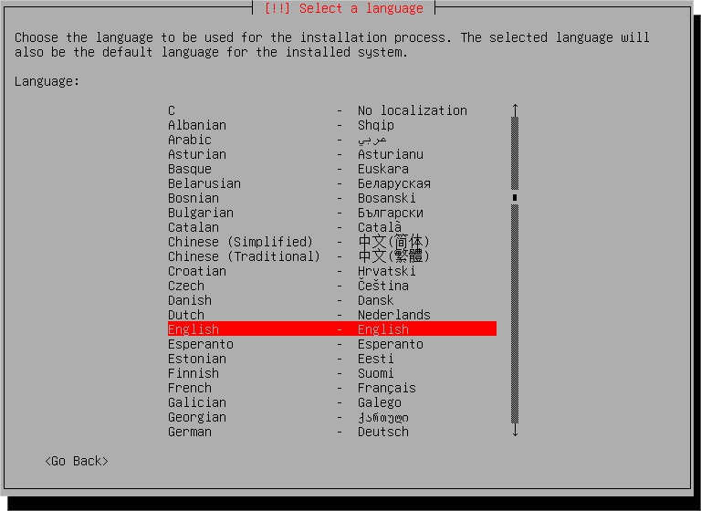

  13 - Escogemos un pais.
  
  
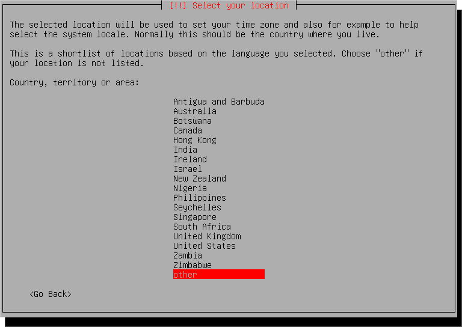

  

  

  14 - Seleccionamos `United States`.
  
  

  15 - Yo elegiré `American English` como idioma de teclado, pero puedes escoger el que quieras.
  
  

  16 - Para el `Host Name` debemos escribir tu login seguido de 42.

  
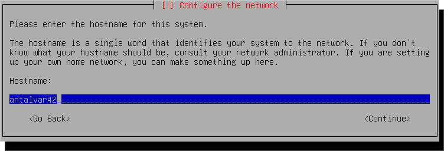

  17 - El subject no menciona nada sobre el `Domain name`, así que lo dejamos vacío.
  
  

  18 - Ahora debemos introducir una contraseña, la usaremos más adelante así que apúntatela o acuerdate porque si no tendrás que comenzar de nuevo.
    
  

  

  19 - Elegiremos un nombre de usuario. Llamaré a este usuario con mi login.
    
  

  
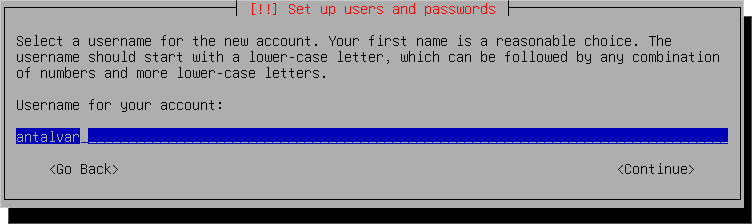

  
  20 - Elegiremos la contraseña para nuestro nuevo usuario. Apúntala o acuerdate, que te hará falta.
  
  
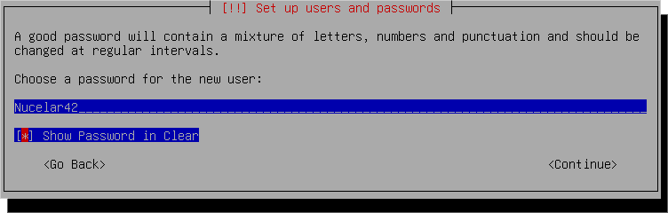

  21 - Elegimos una zona horaria para configurar el reloj.
  
  

  22 - Escogeremos la opción de `Manual` porque queremos realizar el bonus, de lo contrario podemos darle a `Guied - use entire disk and set up encrypted LVM`, que nos facilita la creación de la partición cifrada. Yo voy a crearla manualmente.
  
  

  23 - Seleccionamos el disco en el que vamos a hacer la partición.
  
  

  24 - Para realizar la partición debemos seleccionar `Separate /home partition`.
  
  

  25 - Seleccionamos `Yes` para escribir los cambios en los discos y configurar el LVM.
  
  

  26 - Cancelamos, no nos hace falta borrar los datos del disco.
  
  

  27 - Ponemos una contraseña para la encriptación. Vuelve a apuntarte esto que es importante.
  
  
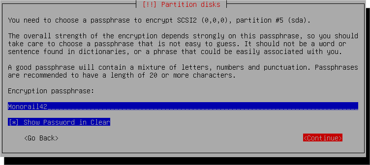

  

  28 - Debemos introducir la cantidad de volumen que usaremos para la partición, en mi caso `30,80GB`.
  
  
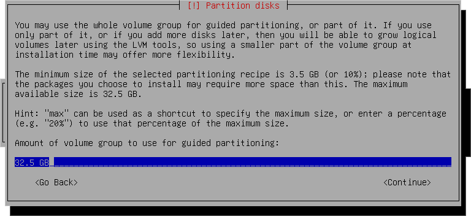

  29 - Para terminar la partición presionamos `Finish partitioning and write changes to disk`.
  
  

  30 - `Yes` a escribir los cambios en los discos.  
  
  

  31 - `No` puesto que no queremos paquetes adicionales.
  
  

  32 - Escogemos nuestro país.
  
  

  33 - Seleccionamos `deb.debian.org`.
  
  

  34 - Lo dejamos vacío y `Continue`.
  
  

  35 - Le damos a `No`, no nos interesan que vean nuestras estadísticas.
  
  

  36 - Desmarcamos todas las opciones.
  
  

  37 - Seleccionamos `Yes` para instalar GRUB boot.

  

  38 - Escogemos el dispositivo para la instalación del cargador de arranque. `/dev/sda (ata_VBOX_HARDDISK)`.
  
  
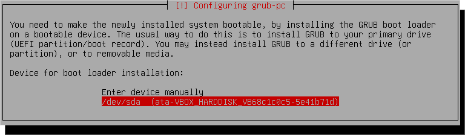

  39 - `Continue` y finalizamos la instalación.
    
  

  
  
  
 
