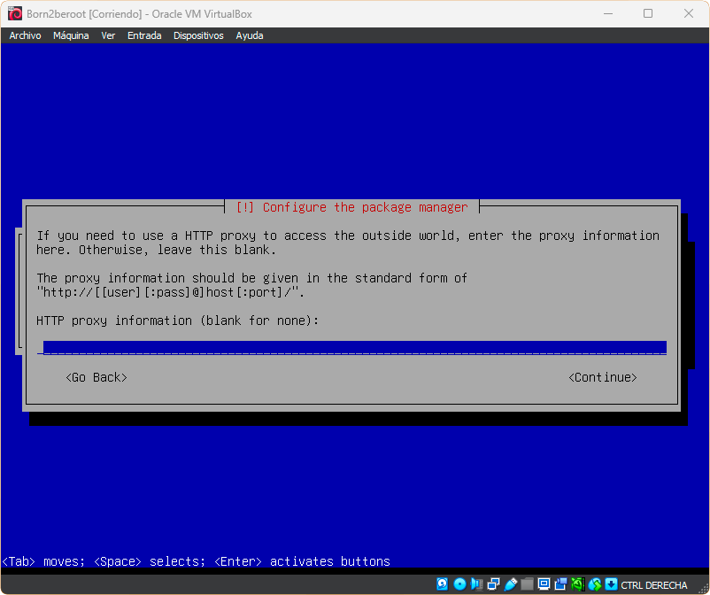
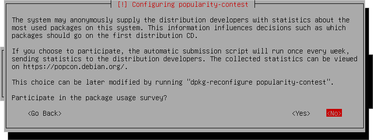
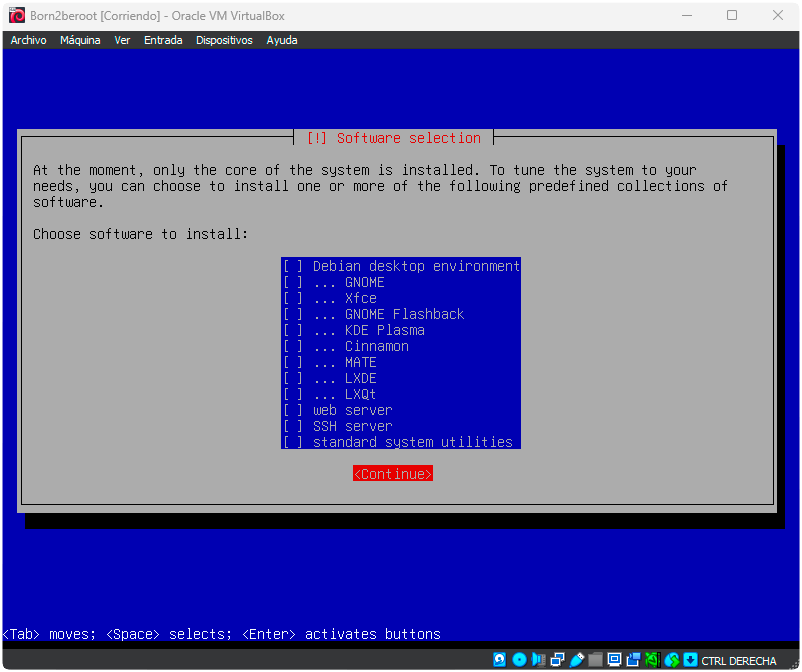
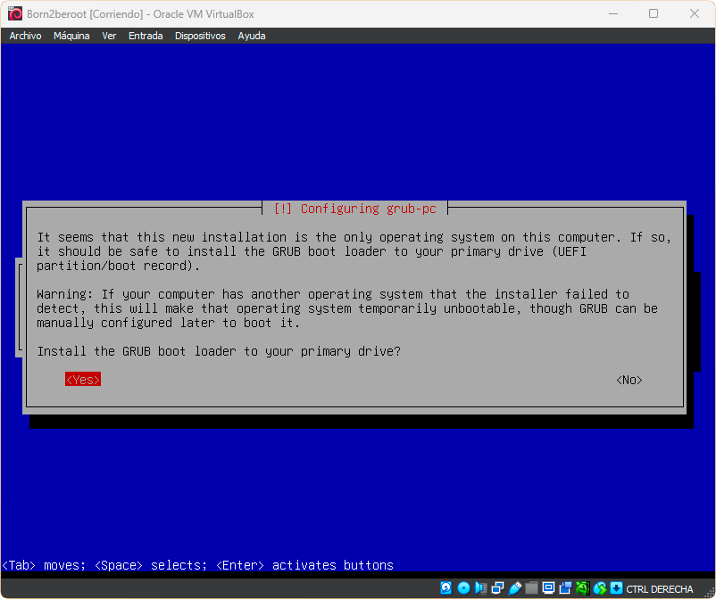
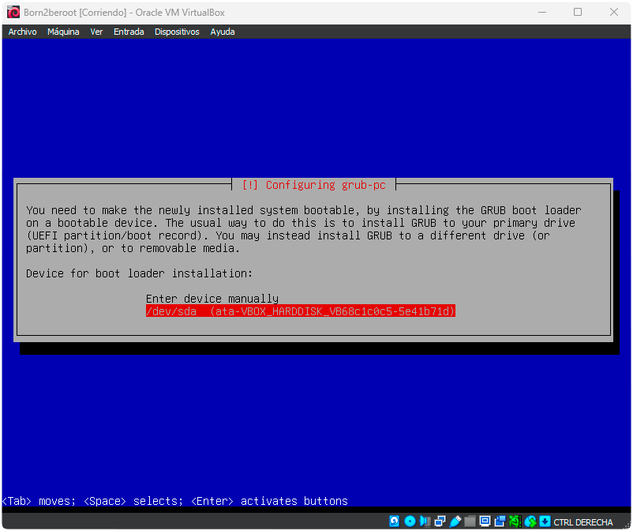
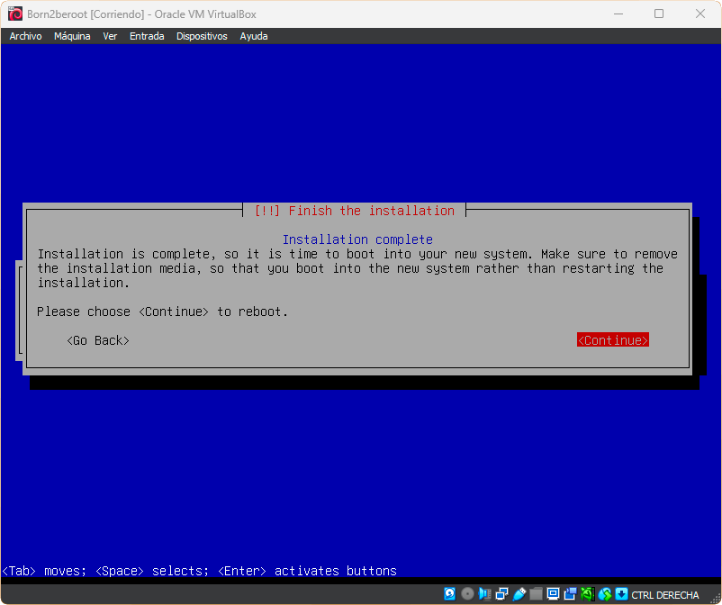

  

## About

Este documento es n ejercicio de administración de sistemas.

Este proyecto busca introducirte al maravilloso mundo de la virtualización.

Crearás tu primera máquina en VirtualBox (o UTM si no puedes utilizar VirtualBox) bajo instrucciones específicas. Por lo tanto, al final del proyecto, serás capaz de configurar tu propio sistema operativo utilizando reglas estrictas.

[Click aquí](./es.subject.pdf) para ver el `PDF` del proyecto.

  ## 2- Instalacion de la maquina 🛠

  Abrimos VirtualBox y pinchamos en `Nueva`
  
  

  

  

  

  

  

  

  

  

  

  

  

  

  

  

  

  

  

  

  

  

  

  

  

  

  

  

  

  

  

  

  

  

  

  

  

  

  

  

  

  

  

  

  

  

  

  
  
  
